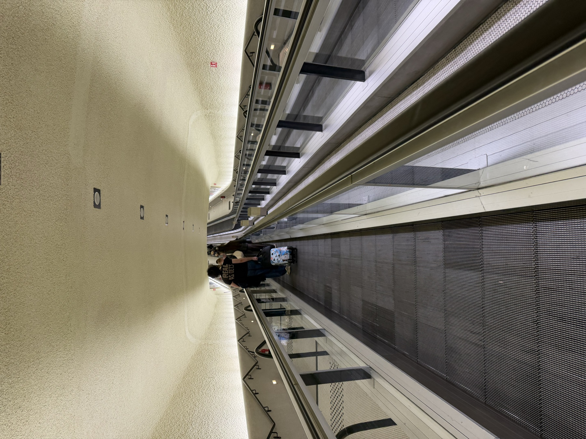

# Eurotrip 2026 — trip site

A single-page static site about Aaron's 23 Aug – 3 Sep 2026 trip:
Chicago → Paris → Florence → Rome → Israel → home. Built to share with
friends and family. Everything lives in `index.html` — no build step, no
dependencies. Open it in a browser to view.

## Current state

Complete. All contact-sheet frames (Paris, Florence, Rome, Israel, plus a
small 2-frame Home strip) hold real photos pulled from the Google Photos
export, geo/time-matched to each leg and hand-picked for quality — see
`photos/` and the `<figure>` markup in `index.html` for the final picks.

Not photographed in this export: the Rome Vespa tour (Vahid) and the
Florence hills e-bike ride are personal-camera-roll-only here — the
professional shots from those two hosts are still in Airbnb Messages and
would need pulling in separately if wanted.

## Photo frames, for future edits

Each contact sheet holds real `.frame` figures now:

```html
<figure class="frame"><figcaption>The walkway in, CDG Terminal 1</figcaption></figure>
```

`.frame img` is styled (4:3, `object-fit: cover`, same border the old wells
had) so no CSS changes are needed to swap a photo. Images live in `photos/`,
named `<leg>-<NN>.jpg` (e.g. `par-01.jpg`). Add or remove frames freely — the
sheets are auto-fill grids — and keep each caption matched to what's
actually in that photo, and the "N frames" count in each `.sheet-head`
matched to the frame count.

If better shots turn up later (e.g. the Vespa/e-bike sets from Airbnb
Messages), swap the `src`/`alt`/caption in place; there's no other wiring.

## Design

Concept: the trip as a book of ticket stubs. Each leg is a ticket — signage
header band, perforated tear line (`.perf`, with punched notches at both
edges), a mono data strip of the real record locators, and for the three
Airbnb cities a second torn-off `.ticket-stay` stub underneath.

- **Type** — Archivo Narrow (signage: city names, headings), Newsreader
  (narrative), IBM Plex Mono (all ticket data, labels, times)
- **Color** — pale grey-green security-print stock, deep teal accent,
  muted stamp red used once on the footer stamp
- **Themes** — full light and dark palettes as CSS custom properties on
  `:root`, redefined under `prefers-color-scheme` and `[data-theme]`.
  Never set a color outside the token system; both themes must work.
- **Numbering** — LEG 01…05 is a real sequence (legs of one journey), not
  decoration. Keep it meaningful if sections are added.

## Facts and sources

Every number on the page came from a booking confirmation or the Airbnb app.
Do not invent details; if something is unverified, leave it off.

| Leg | Detail | Source |
|---|---|---|
| Paris | UA987 ORD 18:10 → CDG 09:20, 787-10, rec BPFH7K | Air Canada email |
| Paris | Louvre VIP tour, Mon 24 15:45, Arc de Triomphe du Carrousel | Viator 1440148467 |
| Paris | Le Bazar, Mon 24 20:30, Levallois-Perret | Google/Zenchef |
| Paris | Versailles e-bike + hamlet, Tue 25 12:15 | Unlimited Biking #18330649 |
| Paris | Safrane, Tue 25 20:00, 17th | Uniiti |
| Paris | Crazy Horse, Tue 25 evening | order 862506 |
| Paris | Stay: Xavier, Aug 24–26, Pompidou/Bastille | Airbnb app |
| Florence | VY1503 ORY 09:30 → FLR 11:20, rec LMGZ6Q | Vueling email |
| Florence | Accademia + Bargello 72h, Wed 26 13:30 | order 24018019 |
| Florence | E-bikes in the hills, Wed 26 17:00–19:00, Gabriele | Airbnb app |
| Florence | Stay: Lorenzo, Aug 26–28, by the Fortezza da Basso | Airbnb app |
| Rome | Italo 8951, Firenze SMN 09:03 → Roma 11:05, coach 6 seat 77, IYG5JI | Italo email |
| Rome | Vespa tour w/ photographer, Fri 28 15:00–16:45, Vahid | Airbnb app |
| Rome | Ba' Ghetto, Fri 28 19:30, Via del Portico d'Ottavia 57 | Superb email |
| Rome | Stay: Andrea, Aug 28–31, Campo de' Fiori / the Ghetto | Airbnb app |
| Israel | Wizz W4 6041 FCO T3 05:30 → TLV 10:00, seat 31A, PSH5HK | Wizz email |
| Israel | ETA-IL approved 28 Aug | piba.gov.il email |
| Home | SWISS LX8 ZRH 13:05 → ORD T5 15:55, 777-300ER, business, 07K, gate E23, ACKRAO | Air Canada / SWISS |

**Known gap:** there is no confirmation anywhere for the Tel Aviv → Zurich
leg. The page deliberately does not claim one. If Aaron supplies it, add it
to the Home ticket.

## Publishing

Not yet published. Options: publish as a Claude Artifact for a private
shareable link, or serve `index.html` from GitHub Pages on this repo.
